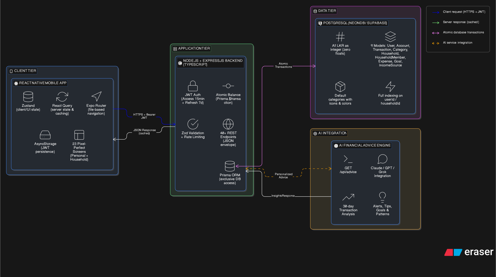

<div align="center">


<br /><br />

# 🐝 Budget Bee

### *Small savings. Big goals. Bright future.*

**A bilingual (English / தமிழ் / සිංහල) personal finance app built for Sri Lanka**

---

</div>

> ⚠️ **This project is currently under active development (v2.0 - alpha).** Core backend infrastructure and several frontend screens are functional. This repository serves as a portfolio piece demonstrating full-stack mobile development, system design, and AI integration capabilities.

---

## 📖 Table of Contents

- [About the Project](#-about-the-project)
- [Key Features](#-key-features)
- [System Architecture](#-system-architecture)
- [Tech Stack](#-tech-stack)
- [Project Status](#-project-status)
- [Getting Started](#-getting-started)
- [Folder Structure](#-folder-structure)
- [Roadmap](#-roadmap)
- [Contributing](#-contributing)
- [Contact](#-contact)

---

## 💡 About the Project

Managing personal finances in Sri Lanka comes with unique challenges — juggling multiple accounts across banks like BOC and NSB, tracking utility bills (SLT, CEB, Water Board), and working in LKR without the rounding errors that floating-point arithmetic causes. Most existing apps are built for Western markets and ignore these local realities entirely.

**Budget Bee** was designed from the ground up for Sri Lankan users. It supports both **Personal Mode** (individual finance tracking) and **Household Mode** (shared family or group budgeting), with full bilingual support in English and Sinhala. An integrated AI advice engine analyzes your 30-day transaction history to surface personalized insights — whether that's an overspending alert on groceries or a savings tip to help you hit your next goal.

This project represents my personal initiative to build something meaningful for the local context while demonstrating skills across the full stack: React Native, Node.js, PostgreSQL, Prisma ORM, JWT authentication, and LLM integration.

---

## ✨ Key Features

| Feature | Description | Status |
|---|---|---|
| 🔐 **Auth & Onboarding** | JWT-based login/register with refresh tokens, splash screen, and onboarding slides | ✅ Implemented |
| 📊 **Dashboard** | Visual analytics — donut, bar, and line charts for balances, spending, and period comparisons | ✅ Implemented |
| 💸 **Transactions** | Add income/expenses with categories, custom numeric keypad, atomic balance updates | ✅ Implemented |
| 🏦 **Account Management** | Track multiple bank accounts, cash wallets, and cards with real-time balances | ✅ Implemented |
| 🤖 **AI Advice Engine** | Personalized insights via LLM (Claude/GPT/Grok) based on 30-day transaction history | ✅ Implemented |
| 📋 **Budget Tracking** | Category-based budget limits with visual progress indicators | ✅ Implemented |
| 🔔 **Bills & Reminders** | Recurring bills with priority levels (High/Medium/Low) and pay-now functionality | 🔄 In Progress |
| 🎯 **Savings Goals** | Set and track goals with progress bars and milestone markers | 🔄 In Progress |
| 💰 **Income Sources** | Manage recurring incomes that auto-generate transactions | 🔄 In Progress |
| 👨‍👩‍👧 **Household Mode** | Shared budgeting for families/groups with member management | ⏳ Planned |
| 🌐 **Bilingual UI** | Full English / Sinhala language toggle | ⏳ Planned |
| 🌙 **Dark / Light Theme** | System-aware theming with manual override | ⏳ Planned |

---

## 🏗️ System Architecture

Budget Bee follows a clean **4-tier architecture** designed for scalability and maintainability. Each tier has a single responsibility, keeping concerns well-separated from the mobile client all the way down to the AI layer.

<br />



<br />

**Tier Breakdown:**

**① Client Tier** — React Native (Expo) app with Zustand for local state, React Query for server state synchronization, and Expo Router for type-safe file-based navigation.

**② Application Tier** — Node.js + Express.js backend with strict TypeScript, Zod validation on all inputs, JWT-based auth (15-min access + 7-day refresh tokens), and Prisma ORM for all database interactions. Atomic transactions ensure balance integrity.

**③ Data Tier** — PostgreSQL database with 9 core models: `User`, `Account`, `Transaction`, `Category`, `Budget`, `Bill`, `Goal`, `IncomeSource`, and `HouseholdMember`. All monetary values stored as LKR integers to avoid floating-point precision errors.

**④ AI Integration Tier** — A dedicated advice engine that aggregates the last 30 days of transaction data and sends structured context to an LLM (Claude / GPT / Grok) to generate personalized financial insights, spending alerts, and savings recommendations.

---

## 🛠️ Tech Stack

**Frontend**
- [React Native](https://reactnative.dev/) (Expo SDK 51+) + TypeScript
- [Expo Router](https://expo.github.io/router/) — file-based navigation
- [Zustand](https://zustand-demo.pmnd.rs/) — client state management
- [React Query](https://tanstack.com/query) — server state & caching
- [react-native-chart-kit](https://github.com/indiespirit/react-native-chart-kit) — charts & analytics
- [NativeWind](https://www.nativewind.dev/) — Tailwind CSS for React Native
- [react-hook-form](https://react-hook-form.com/) — form handling

**Backend**
- [Node.js](https://nodejs.org/) + [Express.js](https://expressjs.com/) + TypeScript
- [Prisma ORM](https://www.prisma.io/) — database access layer
- [PostgreSQL](https://www.postgresql.org/) — primary database (NeonDB / Supabase compatible)
- [JWT](https://jwt.io/) — authentication (access + refresh token pattern)
- [Zod](https://zod.dev/) — runtime schema validation
- [bcrypt](https://github.com/kelektiv/node.bcrypt.js) — password hashing
- [pnpm workspaces](https://pnpm.io/workspaces) — monorepo management

**AI & Other**
- LLM integration via Claude / GPT / Grok APIs
- Currency: LKR integers only (no floating-point)
- Platform targets: iOS + Android (Expo Go compatible)

---

## 📦 Project Status

This project is in **active development** as a v2.0 rewrite. Below is a snapshot of current progress:

```
Backend
  ✅ Database schema (all 9 Prisma models)
  ✅ Auth API (register, login, refresh)
  ✅ Transactions API (CRUD + atomic balance updates)
  ✅ Accounts API
  ✅ AI Advice API
  🔄 Bills & recurring income APIs
  ⏳ Household sharing API

Frontend
  ✅ Onboarding & Auth screens
  ✅ Dashboard (with charts)
  ✅ Add Transaction screen (custom keypad)
  ✅ Budget screen
  🔄 Bills & Goals screens
  ⏳ Household mode screens
  ⏳ Bilingual toggle
  ⏳ Settings & theme switcher
```

**Target completion: Q2 2026**

---

## 🚀 Getting Started

> **Prerequisites:** Node.js 18+, PostgreSQL, pnpm, Expo CLI

### 1. Clone the repository

```bash
git clone https://github.com/yourusername/budget-bee.git
cd budget-bee
```

### 2. Backend setup

```bash
cd budget-bee-backend

# Install dependencies
pnpm install

# Configure environment variables
cp .env.example .env
# → Fill in DATABASE_URL, JWT_SECRET, JWT_REFRESH_SECRET, AI_API_KEY

# Run database migrations and seed data
npx prisma migrate dev --name init
npx prisma db seed

# Start the backend dev server (http://localhost:3000)
pnpm dev
```

### 3. Frontend setup

```bash
cd budget-bee-frontend

# Install dependencies
pnpm install

# Start Expo dev server
expo start
# → Scan QR code with Expo Go app (iOS / Android)
```

---

## 📁 Folder Structure

```
BudgetBee/
│
├── budget-bee-backend/              # Node.js + Express API
│   ├── dist/                        # Compiled TypeScript output
│   ├── node_modules/
│   ├── prisma/                      # Prisma schema & migrations
│   ├── src/
│   │   ├── config/                  # Environment & app configuration
│   │   ├── controllers/             # Route handler logic
│   │   ├── middleware/              # Auth, validation, rate limiting
│   │   ├── routes/                  # Express route definitions
│   │   ├── services/                # Business logic layer
│   │   ├── types/                   # Shared TypeScript types
│   │   ├── utils/                   # Helper utilities
│   │   ├── app.ts                   # Express app setup
│   │   └── index.ts                 # Server entry point
│   ├── .env
│   ├── .env.example
│   ├── .gitignore
│   ├── package.json
│   ├── pnpm-lock.yaml
│   ├── prisma.config.ts
│   ├── tsconfig.json
│   └── validate.log
│
└── budget-bee-frontend/             # React Native (Expo) app
    ├── .expo/
    ├── app/
    │   ├── (app)/                   # Authenticated app screens
    │   │   ├── accounts/            # Account management screens
    │   │   ├── transactions/        # Transaction screens
    │   │   ├── _layout.tsx          # App layout wrapper
    │   │   ├── add.tsx              # Add transaction screen
    │   │   ├── advices.tsx          # AI advice screen
    │   │   ├── budget.tsx           # Budget tracking screen
    │   │   ├── income.tsx           # Income sources screen
    │   │   ├── index.tsx            # Dashboard (home) screen
    │   │   ├── more.tsx             # More options screen
    │   │   ├── settings.tsx         # Settings screen
    │   │   └── transactions.tsx     # Transactions list screen
    │   └── (auth)/                  # Auth flow screens
    │       ├── _layout.tsx          # Auth layout wrapper
    │       └── index.tsx            # Login / Register screen
    ├── assets/                      # Images, fonts, icons
    ├── components/                  # Reusable UI components
    ├── lib/                         # Utility libraries & helpers
    ├── node_modules/
    ├── store/                       # Zustand state stores
    ├── .env.local
    ├── .gitignore
    ├── app.json                     # Expo app configuration
    ├── babel.config.js
    ├── expo-env.d.ts
    └── global.css                   # Global styles (NativeWind)
```

---

## 🗺️ Roadmap

- [x] Core backend API with authentication
- [x] Dashboard & transaction management
- [x] AI advice engine integration
- [ ] Complete bills & recurring income features
- [ ] Full savings goals implementation
- [ ] Household Mode with member management
- [ ] Sinhala language toggle (i18n)
- [ ] Push notifications for bill reminders
- [ ] Dark / Light theme
- [ ] App Store & Play Store deployment

---

## 🤝 Contributing

This project is primarily a personal portfolio piece, but pull requests are welcome — particularly for bug fixes or incomplete screens.

```bash
# Fork the repo → create your branch → submit a PR
git checkout -b feature/your-feature-name
git commit -m "feat: describe your change"
git push origin feature/your-feature-name
```

Please keep PRs focused and well-described.

---

## 📬 Contact

**Sivakumar** — Colombo, Sri Lanka

- 📧 Email: [tishanthsivakumar007@gmail.com](mailto:tishanthsivakumar007@gmail.com)
- 💼 LinkedIn: [https://www.linkedin.com/in/tishanth-t007/](https://www.linkedin.com/in/tishanth-t007/)

---

<div align="center">

*Built with ❤️ in Sri Lanka 🇱🇰*

</div>